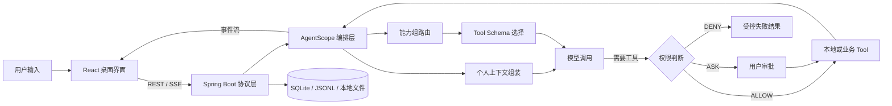

<div align="center">
  
  <h1>ButvanAgent</h1>
  <p>一个本地优先、面向真实工作流的桌面 Agent 工作台。</p>
  <p>
    React 19 · Tauri 2 · Spring Boot 3 · AgentScope Java 2
  </p>
</div>

> 当前版本：`0.3.0`。项目仍在快速迭代，适合本地体验、二次开发和架构交流；暂不把它描述成已经完成的通用生产级 Agent 平台。

## 为什么做这个项目

最初想解决的问题并不复杂：我希望 AI 不只是停留在一个聊天框里，而是能真正理解当前项目、调用本机工具、记住必要的个人上下文，并在日历、资料、财务和学习这些长期数据之间建立联系。

真正开始实现后，问题很快从“接一个模型 API”变成了几条更难的链路：

- 模型可以调用工具，但什么工具应该在什么时候暴露？
- Agent 可以写文件、跑命令，但风险动作由谁确认，刷新后又如何恢复？
- 上下文越多不等于效果越好，怎样让 Prompt、记忆和 Tool Schema 都有明确预算？
- 桌面应用既要方便开发，又要让安装包自带后端和运行时，不能要求用户额外配置 Java。
- 日历、资料、财务和学习记录不是几张孤立页面，它们怎样成为 Agent 可以安全使用的个人上下文？

ButvanAgent 是对这些问题的一次持续落地。它不是把所有能力堆进 System Prompt，而是尽量把每一类能力放回自己的边界：界面负责交互，服务层负责协议，Agent 层负责编排，业务数据留在本机，权限和上下文在真正调用模型前收口。

## 现在已经做到哪一步

### 1. 对话不只负责“聊”

- 支持 OpenAI、Gemini、DeepSeek、Anthropic、DashScope 五类模型供应商。
- 基于 SSE 展示回答、Thinking、工具调用、子 Agent 进度和最终状态。
- 普通会话与项目会话分开管理；项目会话可以关联本地工作区。
- 支持中止运行，并保留 partial assistant、工具状态和 Token 用量。
- 支持会话标题生成、权限模式切换、Token 明细和上下文占用查看。

### 2. 工具能力有边界，也有兜底

目前的工具被划分为工作区、记忆、规划、委派、Skill、联网、日历、财务、资料和学习等能力组。默认只常驻轻量元工具，具体 Tool Schema 按本轮任务延迟暴露。

Jev 路由是一个可选优化：它先判断本轮可能需要哪些能力组，再由 ButvanAgent 本地组装 Schema。Jev 不保存工具、不执行工具，也不拥有权限判断；路由失败时仍保留 Agent 自主补选能力的入口。

### 3. 高风险动作不会悄悄发生

- 工具权限支持 `ALLOW`、`ASK`、`DENY` 分级处理。
- 高风险调用会形成一张批量审批卡片，可逐项决定或批量处理。
- 审批与原始 `runId` 绑定，避免恢复时重新执行同一批工具。
- 自定义规则从 `~/.butvan-agent/permissions.yaml` 读取。
- 文件与命令能力仍以本机权限为上限，不绕过操作系统安全边界。

### 4. 个人数据开始形成闭环

| 模块 | 当前能力 | Agent 接入方式 |
| --- | --- | --- |
| 日历 | 待办、日程、花销、手记与循环待办 | 受控业务 Tool + 今日上下文 |
| 财务 | 账户、收支、转账、流水编辑、余额调整与趋势统计 | 最小化汇总，敏感分析逐次确认 |
| 资料 | 富文本编辑、分类 Tab、标签、附件、回收站与备份恢复 | 稳定 ID 引用 + 字符预算 |
| 学习 | 开始、结束、补录、分类、统计与年度热力图 | 业务 Tool + SSE 跨窗口同步 |
| 个人上下文 | 画像、记忆召回、维护提案与显式确认 | Model Call 前临时注入 |
| Token 用量 | 轮次、模型调用、输入归因与年度活动统计 | 原始记录 + SQLite 读模型 |

聊天输入框还提供一层本地 Slash Command 路由。像 `/status`、`/today`、`/spending` 这类确定性查询不必调用模型；`/daily-review`、`/finance-review` 等分析命令则会先确认数据范围，再把受控上下文交给 Agent。

## 一次请求是怎么走完的



这里有三个刻意保留的设计决定：

1. **前端不直接拥有业务数据。** API、SSE 和错误映射集中在 `services`，页面只做状态编排。
2. **Agent 不直接拥有持久化。** Agent Tool 通过业务 Adapter 访问日历、财务、资料和学习服务，稳定 ID 比磁盘路径更重要。
3. **上下文不进入长期状态。** 画像和记忆只在 Model Call 前按预算临时注入，避免污染 transcript，也避免每轮重复携带整个工作区。

## 技术栈

| 层次 | 主要技术 | 作用 |
| --- | --- | --- |
| 桌面壳 | Tauri 2、Rust | 窗口与系统能力、sidecar 生命周期、动态端口注入 |
| 前端 | React 19、TypeScript 6、Vite 8、CSS Modules | 页面、领域组件、SSE 状态与本地交互 |
| 编辑与展示 | Tiptap 3、React Markdown、Shiki、Mermaid | 资料编辑、Markdown、代码高亮与图表 |
| 后端 | Java 21、Spring Boot 3.4 | REST/SSE、业务服务、文件资产与本地持久化 |
| Agent | AgentScope Java 2.0 | 模型调用、Middleware、Tool、状态与多 Agent 编排 |
| 数据 | SQLite、JSONL、本地文件 | 结构化业务数据、原始用量记录、会话与文件对象 |
| 构建 | Maven、pnpm、Cargo、jlink | 前后端构建、最小 JRE 与跨平台桌面安装包 |

## 快速开始

### 环境要求

开发环境需要：

- JDK 21（必须包含 `jlink` 与 `jdeps`）
- Maven 3.9+
- Node.js 20+
- pnpm 9+
- Rust stable 与 Cargo
- Tauri 对应平台的系统依赖

只有从源码开发或打包时需要这些工具。正式安装包会内嵌 Spring Boot sidecar 与最小 JRE，使用者无需单独安装 Java。

### 1. 获取代码与安装前端依赖

```bash
git clone https://github.com/agent-butvan/OpenAgent-Van.git
cd OpenAgent-Van
pnpm --dir agent-frontend install
```

### 2. 启动后端

在一个终端中运行：

```bash
cd agent-backend
mvn -pl server-network -am spring-boot:run
```

开发模式默认监听 `http://localhost:8081`。可先检查健康状态：

```bash
curl http://localhost:8081/api/health
```

也可以直接在 IDE 中运行 `ButVanAgentApplication`。

### 3. 启动桌面端

在另一个终端中运行：

```bash
cd agent-frontend
pnpm tauri dev
```

`tauri dev` 不会打包或拉起后端，这是有意保留的开发边界：前端热更新与后端调试彼此独立，日志也更容易观察。

首次进入应用时，初始化页会引导填写模型供应商、模型名称和 API Key。配置只写入当前用户目录，不进入仓库。

### 只开发浏览器界面

后端启动后，也可以仅运行 Vite：

```bash
pnpm --dir agent-frontend dev
```

浏览器模式同样连接 `http://localhost:8081`，但不具备 Tauri 原生窗口与系统能力。

## 本地配置与数据

ButvanAgent 的默认用户数据根目录是：

```text
~/.butvan-agent/
├── config.json              # 模型、联网搜索、Jev、邮件与飞书配置
├── permissions.yaml         # 自定义工具权限规则
├── data/
│   ├── butvan.db            # 日历、财务、资料、学习等结构化数据
│   └── files/objects/       # 文件资产二进制对象
├── transcripts/             # 会话与轮次原始记录
├── runs/                    # 未结束运行的临时恢复信息
├── usage/system-usage.jsonl # 标题等非聊天模型调用用量
└── profile/                 # 个人画像、设置、提案与确认历史
```

几个需要特别说明的口径：

- API Key 和 SMTP、飞书等凭据只保存在本地 `config.json`，不会写入源码或 `application.yml`。
- 供应商返回的 Usage 是实际总量；System、History、Tool Schema、RAG 等分类是本地估算，两者不会互相补齐。
- SQLite 中的 Token 表是可重建的统计读模型，原始事实仍以 transcript 和 usage JSONL 为准。
- 通用文件通过 `FileAssetService` 管理所有权、绑定和生命周期；业务表只保存稳定文件 ID。
- 个人画像维护默认关闭。即使开启，也只生成带来源与置信度的提案，必须由用户确认后才会写入画像。

如需备份，建议在应用退出后整体复制 `~/.butvan-agent/`。资料模块也提供自己的 ZIP 导入与导出能力。

## 可选能力

### Tavily 联网搜索

联网搜索默认关闭。需要在 `~/.butvan-agent/config.json` 中配置 `webSearch` 节点后才会启用。

### Jev Tool Schema 路由

Jev 默认关闭。配置完成后，可在聊天输入区切换启用状态。它只参与能力组预测，最终 Schema 选择、权限判断和工具执行仍在本地完成。

### 飞书渠道

`server-feishu` 通过飞书长连接接收消息，并复用 `server-agents` 的编排能力。未配置 `feishu.enabled=true`、`appId` 和 `appSecret` 时不会启动连接。

### 邮箱绑定与通知

当前邮箱是本机用户的可选通知地址，不是云端账户。验证码发送依赖本地 SMTP 配置；未配置时相关接口会明确返回不可用状态。

## 项目结构

```text
ButvanAgent/
├── agent-frontend/              # React、Vite 与 Tauri 桌面端
│   ├── src/components/          # 公共组件与聊天、日历、财务、资料、学习等领域组件
│   ├── src/features/            # Slash Command 等前端领域能力
│   ├── src/services/            # REST、SSE、存储和第三方调用适配
│   ├── src/types/               # 前端领域类型与 DTO
│   └── src-tauri/               # Rust 壳层、sidecar 管理与桌面配置
├── agent-backend/
│   ├── server-agents/           # AgentScope、模型、Tool、上下文、权限与编排
│   ├── server-network/          # Controller、业务服务、SQLite 与文件资产
│   ├── server-feishu/           # 飞书渠道适配
│   └── scripts/                 # 后端 sidecar 组装
├── scripts/                     # 桌面打包、版本同步与 sidecar 验证
├── AGENTS.md                    # 全仓工程契约（DOX）
├── CONTEXT.md                   # 领域术语与数据口径
├── DESIGN.md                    # 视觉系统
├── PROJECT.md                   # 项目规格
├── PRODUCT.md                   # 产品定位
└── VERSION                      # 桌面端唯一版本源
```

后端依赖方向保持单向：

```text
server-network ──> server-agents
       │
       └────────> server-feishu ──> server-agents
```

`server-agents` 不反向依赖网络层的业务实现。需要把日历、财务等能力交给 Agent 时，由 `server-network` 提供 Tool Adapter，而不是让编排层直接操作数据库。

## 验证

提交前至少运行与改动范围对应的检查。完整基线可以这样执行：

```bash
# 后端测试
mvn -f agent-backend/pom.xml test

# 前端静态检查与生产构建
pnpm --dir agent-frontend lint
pnpm --dir agent-frontend build

# Rust 壳层检查
cargo check --manifest-path agent-frontend/src-tauri/Cargo.toml

# 版本一致性
node scripts/sync-version.mjs --check
```

后端当前覆盖 Agent 运行、权限、上下文、Token 归因、项目与会话、日历、财务、资料、学习、文件资产和 SSE 等关键路径。桌面 CI 会在 macOS Apple Silicon、macOS Intel、Linux x64 和 Windows x64 上构建，并实际启动 sidecar 检查 `/api/health`。

## 打包与发布

本地一键打包：

```bash
./scripts/build-app.sh
```

快速验证可使用 debug 构建：

```bash
./scripts/build-app.sh --debug
```

脚本会完成版本检查、后端 fat jar、最小 JRE、平台启动器和 Tauri 安装包组装。构建结果位于 `agent-frontend/src-tauri/target/<profile>/bundle/`。

发布使用完整 SemVer tag 驱动，根目录 `VERSION` 是唯一版本源。CI 先校验版本，再构建并验证各平台 sidecar，最后上传到草稿 GitHub Release。

## 开发约定

这个仓库把文档当作工程边界，而不是完成代码后的补充说明。

- 修改文件前先阅读根目录以及目标路径上更近的 `AGENTS.md`。
- 新功能从 `main` 创建独立分支，流向为 `feature/*` → `main` → `develop`。
- Controller 只负责协议适配；业务逻辑进入 Service 或明确的领域组件。
- 前端 API 必须经过 `services`；可复用交互必须沉淀为统一组件。
- 新增 Tool 时同时确认权限、能力分组、Schema 暴露方式、幂等性和测试。
- 涉及职责、接口、持久化、权限或用户体验的变化，完成后必须执行 DOX 复核。

完整规则以 [AGENTS.md](AGENTS.md) 为准。

## 当前限制与接下来要解决的问题

这一阶段最重要的不是继续增加页面数量，而是把已经存在的能力变得更可靠、更可解释：

- 安装包签名仍需完善。未配置签名时，macOS Gatekeeper 与 Windows SmartScreen 警告属于预期现象。
- 资料引用目前以文本和轻量元数据为主，附件 OCR、PDF 分段检索尚未进入上下文。
- Agent 的真正可恢复暂停仍需要明确 checkpoint、待恢复动作和工具幂等语义，当前不会用线程挂起来模拟恢复。
- 邮箱目前只是通知地址；跨设备账户、同步和云端身份不在当前闭环内。
- 模型、外部搜索和 Jev 的可用性取决于对应供应商服务与用户自己的凭据。

后续迭代仍会沿用同一条原则：先把数据口径、权限边界和失败路径讲清楚，再扩大能力范围。

## 文档入口

- [项目规格](PROJECT.md)：产品能力与技术基线。
- [领域术语](CONTEXT.md)：日记录、学习时段、模型调用、Token 用量等统一口径。
- [设计系统](DESIGN.md)：零阴影、小圆角、细描边的桌面视觉规范。

## License

当前仓库尚未声明开源许可证。在许可证补充之前，请不要默认代码可以被复制、修改或再分发；如需使用，请先联系项目维护者确认授权。
