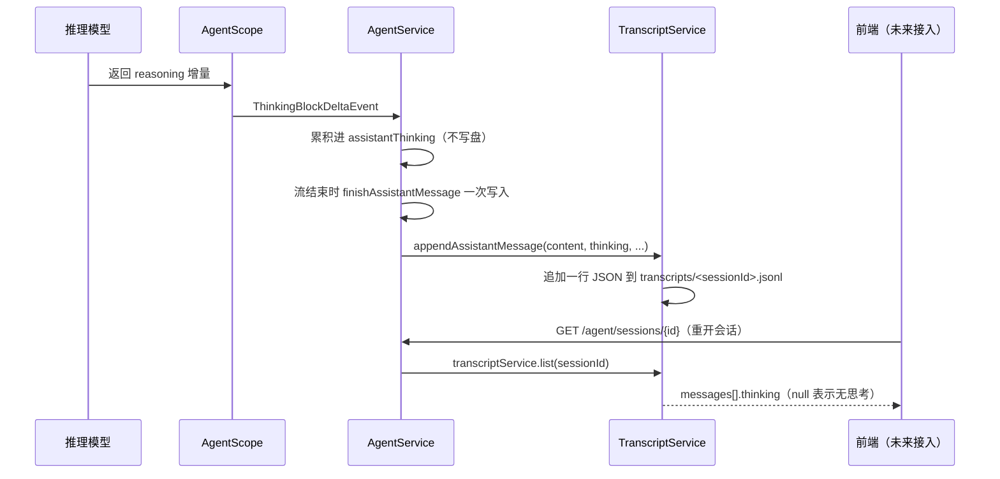

# ButvanAgent Thinking 持久化：后端分步接入教程

> 本教程**只修改后端**。完成后，thinking 会随每条 assistant 消息一起写入本地会话记录（JSONL），重新打开会话时历史接口会把 thinking 原样返回给前端。
>
> **前置条件**：已完成《ButvanAgent-Thinking流式事件后端接入教程》，后端已经能通过 SSE 输出 `event:thinking`。如果还没有，请先完成那份教程再继续。
>
> 前端暂时不消费 thinking 字段也没有关系：历史消息里多出的 `thinking` 字段只会被前端忽略，不影响现有正文、工具调用和状态的展示。本教程不要求修改任何前端文件。

---

## 1. 先理解：Thinking 现在只“看得到”，还没“存下来”

### 1.1 流式链路的现状

上一份教程完成后，thinking 的实时链路是：

```text
ThinkingBlockDeltaEvent（AgentScope）
        ↓ AgentService.mapEvent
AgentStreamEvent.ThinkingDelta
        ↓ 队列 + Controller
SSE event: thinking / data: 文本片段
```

也就是说：**thinking 实时发给前端了，但前端关闭页面后，这份思考过程就丢了。**

### 1.2 落盘链路的现状

会话历史目前由 `TranscriptService` 管理，文件是 `~/butvan-agent/transcripts/<sessionId>.jsonl`，一行一条完整消息 JSON：

```text
用户消息（流开始前写入，一次）
assistant 消息（流正常结束 / 失败 / 取消时写入，一次）
```

`TranscriptMessageDto` 现在只保存：正文 `content`、工具执行 `tools`、状态 `status`、耗时 `durationMillis`。**thinking 不在其中。**

### 1.3 本次目标

把 thinking 变成 assistant 消息的一个**普通可选字段**：

```text
流式期间：ThinkingDelta 累积进 StringBuilder（不写盘，避免逐 token I/O）
流结束时：正文 + thinking 一起，一次性追加一行 JSON
重开会话：历史接口原样返回 thinking（没有思考就是 null）
```

### 1.4 一个不需要担心的点：thinking 不会回填给模型

本项目模型上下文由 AgentScope 的 `agentStateStore` 自动管理，`AgentService` 不手动拼接历史消息。本次写入的 `transcripts/*.jsonl` 是**用户可见层**，与模型上下文完全独立。因此 thinking 存进历史后，**不会**被当作下一轮对话的输入回送给模型，不存在污染上下文的问题。

---

## 2. 本次最终要修改的文件

```text
agent-backend/server-agents/src/main/java/butvan/agent/agents/
├── session/
│   ├── dto/TranscriptMessageDto.java   # assistant 消息增加 thinking 字段（核心）
│   └── TranscriptService.java          # 写入时透传 thinking
└── agent/
    └── AgentService.java               # 流内累积 thinking，流结束时随正文一起写入
```

不修改：

- `AgentController.java`：历史读取接口 `GET /agent/sessions/{sessionId}` 返回的是 `TranscriptMessageDto` 列表，Jackson 会自动序列化新字段，Controller 和 DTO 无需任何改动；
- `AgentStreamEvent.java`：`ThinkingDelta` 事件上一份教程已定义；
- `AgentStreamSession.java`：队列保存的是 `AgentStreamEvent`，天然支持 thinking；
- 所有前端文件。

---

## 3. 开始前检查：确认当前代码和依赖版本

### 3.1 这一步做什么

确认三件事：后端能编译、`ThinkingDelta` 事件已存在、当前 assistant 消息里确实没有 thinking 字段。

### 3.2 执行命令

在项目后端目录执行：

```bash
cd /Users/butvan/Butvan_Projets/my_code/ButvanAgent/agent-backend
JAVA_HOME=$(/usr/libexec/java_home -v 21) mvn -pl server-agents test
```

只有当前后端基础编译通过，才开始下一步。

### 3.3 人工确认两处

打开 `agent-backend/server-agents/src/main/java/butvan/agent/agents/agent/AgentStreamEvent.java`，确认存在：

```java
record ThinkingDelta(String content) implements AgentStreamEvent {
```

再打开会话记录文件（`~/butvan-agent/transcripts/` 下任意一个 `.jsonl`），确认 assistant 消息行**没有** `thinking` 字段。有 `thinking` 说明之前已经改过，请跳过对应步骤。

---

## 4. 第一步：`TranscriptMessageDto` 增加 thinking 字段

### 4.1 这一步做什么

`TranscriptMessageDto` 是用户可见消息的契约，前端历史展示完全依赖它。给它加一个可空的 `thinking` 字段，放在参数列表**最后一位**。

放在最后一位是关键：Jackson 反序列化旧 JSONL 时，缺失的字段自动为 `null`，所以**历史上已经存在的记录无需迁移**，打开旧会话不会报错。

### 4.2 打开文件

打开：

`agent-backend/server-agents/src/main/java/butvan/agent/agents/session/dto/TranscriptMessageDto.java`

### 4.3 修改 record 声明

把 record 声明完整替换为：

```java
/** 用户界面能够稳定展示的一条完整消息。 */
public record TranscriptMessageDto(
        String id,
        String turnId,
        MessageRole role,
        String content,
        Instant createdAt,
        MessageStatus status,
        Long durationMillis,
        List<ToolExecutionDto> tools,
        String thinking        // 新增：assistant 消息的思考过程，可为 null。
) {
```

### 4.4 修改紧凑构造器

把紧凑构造器完整替换为：

```java
    public TranscriptMessageDto {
        content = content == null ? "" : content;
        tools = tools == null ? List.of() : List.copyOf(tools);
        // 空思考不保存：模型没输出 thinking 时统一存 null，前端只需判断 null。
        thinking = (thinking == null || thinking.isBlank()) ? null : thinking;
    }
```

> 归一化规则：`null` 和空白字符串都变成 `null`。这样前端只需要检查 `thinking == null` 一种情况，流式累积出的空 StringBuilder 也能安全传入。

### 4.5 本步骤检查

执行：

```bash
JAVA_HOME=$(/usr/libexec/java_home -v 21) mvn -pl server-agents test
```

**预期：编译会报错**，错误位置是 `TranscriptService.java` 里两处 `new TranscriptMessageDto(...)` —— record 增加了参数，构造调用没跟上。这是**正确且预期的结果**，报错位置正好就是下一步要修改的两个调用点。看到这个报错，说明第一步改对了。

---

## 5. 第二步：`TranscriptService` 透传 thinking

### 5.1 这一步做什么

`TranscriptService` 是唯一读写 transcripts JSONL 的服务。把上一步编译报错的两个构造点补上第 9 个参数：用户消息传 `null`，assistant 消息接收并透传 thinking。

### 5.2 打开文件

打开：

`agent-backend/server-agents/src/main/java/butvan/agent/agents/session/TranscriptService.java`

### 5.3 修改 `appendAssistantMessage` 签名与构造

找到 `appendAssistantMessage` 方法，把整个方法替换为：

```java
    /**
     * 在一次 Agent 流结束后写入完整 assistant 消息
     */
    public synchronized void appendAssistantMessage(
            String sessionId,
            String turnId,
            String content,
            String thinking,
            TranscriptMessageDto.MessageStatus status,
            Long durationMillis,
            List<TranscriptMessageDto.ToolExecutionDto> tools
    ) {
        append(sessionId, new TranscriptMessageDto(
                UUID.randomUUID().toString(),
                turnId,
                TranscriptMessageDto.MessageRole.ASSISTANT,
                content == null ? "" : content,
                Instant.now(),
                status,
                durationMillis,
                tools,
                thinking                        // 新增：透传 thinking，可为 null。
        ));
    }
```

### 5.4 修改 `appendUserMessage` 的构造

用户消息没有 thinking，在构造调用最后补一个 `null`。找到 `appendUserMessage` 方法，把 `append(...)` 调用替换为：

```java
        append(sessionId, new TranscriptMessageDto(
                UUID.randomUUID().toString(),
                turnId,
                TranscriptMessageDto.MessageRole.USER,
                content,
                Instant.now(),
                TranscriptMessageDto.MessageStatus.COMPLETED,
                null,
                List.of(),
                null                                    // 用户消息没有思考过程。
        ));
```

### 5.5 本步骤检查

执行：

```bash
JAVA_HOME=$(/usr/libexec/java_home -v 21) mvn -pl server-agents test
```

**预期：编译通过。** 此时 `TranscriptService` 已经能存 thinking，但还没有人给它传——`AgentService` 的调用点还没改，这一步先不动它。

---

## 6. 第三步：`AgentService` 流内累积 thinking

### 6.1 这一步做什么

`AgentService.produceEvents` 是流式处理的主循环。在这里：

1. 声明一个 `StringBuilder assistantThinking`，和现有的 `assistantContent` 并列；
2. 在事件循环里捕获 `ThinkingDelta` 事件，把增量追加进去。

**关键原则：流内只累积、不写盘。** 与正文完全一致——写盘统一发生在流结束时，由 `finishAssistantMessage` 一次性完成，避免逐 token 打开文件。

### 6.2 打开文件

打开：

`agent-backend/server-agents/src/main/java/butvan/agent/agents/agent/AgentService.java`

### 6.3 声明累积器

在 `produceEvents` 方法开头，找到：

```java
        StringBuilder assistantContent = new StringBuilder();
```

在其下一行插入：

```java
        // 本轮完整 thinking 文本，流结束时随正文一起写入历史。
        StringBuilder assistantThinking = new StringBuilder();
```

### 6.4 在事件循环中捕获 ThinkingDelta

在 `produceEvents` 的事件循环里，找到现有的正文捕获代码：

```java
                AgentStreamEvent mappedEvent = mapEvent(event, toolArgsBuffer);
                if (mappedEvent instanceof AgentStreamEvent.TextDelta textDelta) {
                    assistantContent.append(textDelta.content());
                }
```

紧接着插入 thinking 捕获：

```java
                if (mappedEvent instanceof AgentStreamEvent.ThinkingDelta thinkingDelta) {
                    assistantThinking.append(thinkingDelta.content());
                }
```

加入后，这段逻辑应当是：

```java
                AgentStreamEvent mappedEvent = mapEvent(event, toolArgsBuffer);
                if (mappedEvent instanceof AgentStreamEvent.TextDelta textDelta) {
                    assistantContent.append(textDelta.content());
                }
                if (mappedEvent instanceof AgentStreamEvent.ThinkingDelta thinkingDelta) {
                    assistantThinking.append(thinkingDelta.content());
                }
                collectToolExecution(mappedEvent, toolExecutions);
```

### 6.5 为什么在这里捕获而不是在 `mapEvent`

`mapEvent` 只负责“翻译”，不持有本轮状态。thinking 的完整文本必须跨多个事件累积，所以累积器必须放在 `produceEvents` 这个有状态的主循环里，和正文、工具执行的累积规则保持一致。

### 6.6 本步骤检查

执行：

```bash
JAVA_HOME=$(/usr/libexec/java_home -v 21) mvn -pl server-agents test
```

**预期：编译通过。** 注意此时 thinking 虽然被累积了，但 `finishAssistantMessage` 还没有接收它——功能仍未完成，下一步收尾。

---

## 7. 第四步：把 `finishAssistantMessage` 及其全部调用点接上 thinking

### 7.1 这一步做什么

`finishAssistantMessage` 是唯一写 assistant 消息的出口，它有 **6 个调用点**，覆盖：取消、发送失败、终态、流自然结束、异常取消、异常失败。**每一处都必须传 `assistantThinking`**，否则会出现“正常结束有思考、取消就没有”的不一致。

### 7.2 修改 `finishAssistantMessage` 签名与写入

找到 `finishAssistantMessage` 方法，把整个方法替换为：

```java
    /** 在流结束、失败或取消时仅追加一次完整 assistant 消息。 */
    private void finishAssistantMessage(
            String sessionId,
            String turnId,
            StringBuilder assistantContent,
            StringBuilder assistantThinking,
            TranscriptMessageDto.MessageStatus status,
            Instant statedAt,
            Map<String, TranscriptMessageDto.ToolExecutionDto> toolExecutions
    ) {
        String content = assistantContent.toString();
        String thinking = assistantThinking.toString();

        // 防止系统时钟微笑回拨产生负数
        long durationMills = Math.max(0, Duration.between(statedAt, Instant.now()).toMillis());

        transcriptService.appendAssistantMessage(
                sessionId,
                turnId,
                content,
                thinking,
                status,
                durationMills,
                finalizeToolExecution(toolExecutions, status)
        );

        // 侧边栏预览仍只使用最终正文，不把工具输出混入会话标题和预览
        sessionCatalogService.touch(sessionId, content);
    }
```

> `assistantThinking.toString()` 为空字符串时不用担心：DTO 紧凑构造器已把空白归一为 `null`。

### 7.3 修改 6 个调用点

在 `produceEvents` 中搜索 `finishAssistantMessage(`，会找到 6 处。**逐个**按下面对应代码替换（每处的区别只是缩进和状态参数，别用全局替换，容易改错）。

**调用点 1：客户端取消时（`streamSession.isCancelled()` 分支内）**

```java
                if (streamSession.isCancelled()) {
                    // 取消时保留已输出文本，状态明确标记为 CANCELLED。
                    finishAssistantMessage(request.sessionId(), turnId, assistantContent, assistantThinking,
                            TranscriptMessageDto.MessageStatus.CANCELLED, startedAt, toolExecutions);
                    return;
                }
```

**调用点 2：事件队列写入失败时**

```java
                if (mappedEvent != null && !putEvent(streamSession, mappedEvent)) {
                    finishAssistantMessage(request.sessionId(), turnId, assistantContent, assistantThinking,
                            TranscriptMessageDto.MessageStatus.CANCELLED, startedAt, toolExecutions);
                    return;
                }
```

**调用点 3：收到终态事件（Failed / Completed）时**

```java
                if (mappedEvent != null && mappedEvent.isTerminal()) {
                    finishAssistantMessage(request.sessionId(), turnId, assistantContent, assistantThinking,
                            mappedEvent instanceof AgentStreamEvent.Failed
                                    ? TranscriptMessageDto.MessageStatus.FAILED
                                    : TranscriptMessageDto.MessageStatus.COMPLETED, startedAt, toolExecutions);
                    return;
                }
```

**调用点 4：事件流自然结束时**

```java
            // AgentEvent 流自然结束但未产生 AgentEndEvent 时，仍要给前端和消息记录一个完成状态。
            finishAssistantMessage(request.sessionId(), turnId, assistantContent, assistantThinking,
                    TranscriptMessageDto.MessageStatus.COMPLETED, startedAt, toolExecutions);
```

**调用点 5：异常分支中，线程已被取消时**

```java
                if (turnId != null) {
                    finishAssistantMessage(request.sessionId(), turnId, assistantContent, assistantThinking,
                            TranscriptMessageDto.MessageStatus.CANCELLED, startedAt, toolExecutions);
                }
```

**调用点 6：异常分支中，正常失败时**

```java
            if (turnId != null) {
                finishAssistantMessage(sessionId, turnId, assistantContent, assistantThinking,
                        TranscriptMessageDto.MessageStatus.FAILED, startedAt, toolExecutions);
            }
```

### 7.4 本步骤检查

执行：

```bash
JAVA_HOME=$(/usr/libexec/java_home -v 21) mvn -pl server-agents test
```

**预期：编译通过，后端实现完成。**

---

## 8. 第五步：验证

### 8.1 准备条件

选择一个实际会输出 thinking 的模型，并启用该供应商要求的 reasoning / thinking 参数（与上一份流式教程的验证条件相同）。

### 8.2 启动后端

在 `agent-backend` 目录执行：

```bash
JAVA_HOME=$(/usr/libexec/java_home -v 21) mvn -pl server-network -am spring-boot:run
```

### 8.3 先确认流式仍然正常

通过现有接口创建一个会话并取得真实 `sessionId`，再执行：

```bash
curl -N \
  -X POST \
  -H 'Content-Type: application/json' \
  -d '{"sessionId":"替换为真实会话ID","context":"请分析这个问题并说明你的思路"}' \
  http://localhost:8081/agent/chat/stream
```

仍能看到 `event:thinking`，说明上一份教程的成果没有被破坏。

### 8.4 检查落盘文件

查看会话记录文件（路径固定为 `~/butvan-agent/transcripts/`，文件名是 `sessionId.jsonl`）：

```bash
cat ~/butvan-agent/transcripts/替换为真实会话ID.jsonl
```

**期望**：assistant 那一行 JSON 末尾多出 `thinking` 字段，内容与刚才 SSE 里看到的 thinking 一致：

```json
{"id":"...","turnId":"...","role":"ASSISTANT","content":"最终回答正文...","createdAt":"...","status":"COMPLETED","durationMillis":12345,"tools":[],"thinking":"我先分析问题的约束条件……"}
```

user 那一行没有 `thinking` 字段或为 `null`，属于正常。

### 8.5 检查历史读取接口

重新打开会话时前端调用的是历史接口，验证它原样带出 thinking：

```bash
curl http://localhost:8081/agent/sessions/替换为真实会话ID
```

**期望**：返回的 `messages` 数组中，assistant 消息带有 `thinking` 字段（没有思考时是 `null`，前端按 `null` 处理即可）。

---

## 9. 最终后端链路复盘



完成后的职责边界：

- `TranscriptMessageDto`：消息契约，assistant 消息可携带 thinking；
- `TranscriptService`：唯一读写 transcripts JSONL 的服务，负责透传与归一化；
- `AgentService`：唯一累积 thinking 的地方，只在流结束时一次性写入；
- 历史读取链路（Controller / SessionLifecycleService）：无需改动，Jackson 自动序列化新字段。

---

## 10. 常见问题排查

### 10.1 第四步之后编译报“构造函数参数数量不匹配”

**这是预期行为**：`TranscriptMessageDto` 加了第 9 个参数，`TranscriptService` 的两处构造调用还没跟上。直接进入第五步修改即可，报错消失。

### 10.2 第七步之后仍编译报错，提示 `finishAssistantMessage` 参数不对

说明 6 个调用点有遗漏。在 `produceEvents` 中搜索 `finishAssistantMessage(`，逐一对齐第七步的代码——尤其是第 5、6 处藏在异常分支里，容易漏。

### 10.3 编译通过，但 JSONL 里 assistant 行没有 `thinking`

两种情况：

1. 模型没有输出 thinking（此时 `assistantThinking` 为空字符串，DTO 归一化为 `null`，JSON 里显示 `"thinking":null`）——排查方法同流式教程：换会输出 thinking 的模型、确认 reasoning 参数已开启；
2. 第六步的捕获代码没加——检查事件循环里是否有 `ThinkingDelta` 分支。

### 10.4 旧会话记录没有 `thinking` 字段 / 新记录是 `null`

都是正常现象。字段是最后一位、可空，旧数据无需迁移；前端统一按 `null` 处理即可。

### 10.5 取消或失败时 thinking 丢失，但正常结束时保留

说明第七步只改了部分调用点。6 处调用点必须全部传 `assistantThinking`，否则不同结束路径写入的字段不一致。

### 10.6 thinking 会不会被当作下一轮对话发给模型？

不会。本项目模型上下文由 AgentScope `agentStateStore` 自动管理，`transcripts/*.jsonl` 只是用户可见层，两者完全独立。本次改动没有触碰上下文组装逻辑。
