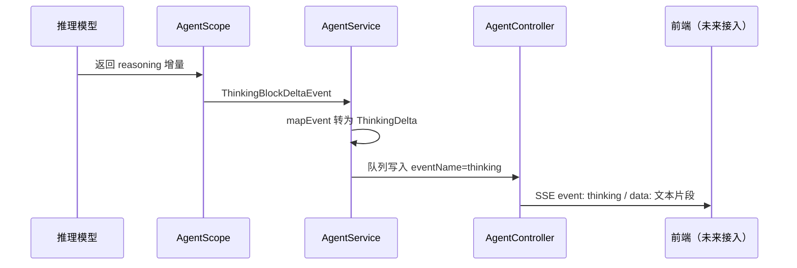

# ButvanAgent Thinking 流式事件：后端分步接入教程

> 本教程**只修改后端**。完成后，后端会把 AgentScope 的 thinking 增量转换为名为 `thinking` 的 SSE 事件并发送给前端。
>
> 前端暂时不解析该事件也没有关系：它只会忽略 `thinking` 数据，不会影响现有文本、工具调用和错误事件。本教程不要求修改任何前端文件。

---

## 1. 先理解：Thinking 不是“正在思考...”文案

当前界面的“正在思考...”只是前端在还没收到正文或工具调用时显示的加载提示；它不是模型实际返回的推理内容。

AgentScope Java 2.0 的模型若返回 reasoning / thinking 内容，会在 `streamEvents()` 中产生以下生命周期事件：

```text
ThinkingBlockStartEvent
        ↓
ThinkingBlockDeltaEvent（0 次或多次，每次是一小段 thinking 文本）
        ↓
ThinkingBlockEndEvent
```

本项目当前已经使用了相同模式处理正文与工具：

```text
TextBlockDeltaEvent          -> AgentStreamEvent.TextDelta  -> SSE event: text
ToolCallStart / EndEvent     -> AgentStreamEvent.ToolCall   -> SSE event: tool_call
ToolResultTextDeltaEvent     -> AgentStreamEvent.ToolResult -> SSE event: tool_result
ThinkingBlockDeltaEvent      -> AgentStreamEvent.ThinkingDelta -> SSE event: thinking
```

因此，本次不是新增一条 HTTP 接口，也不需要修改 `AgentController`。`AgentController` 已经会将 `AgentStreamEvent.eventName()` 和 `payload()` 原样写入 SSE；只要增加新的业务事件和映射即可。

AgentScope 官方将 `ThinkingBlockStartEvent`、`ThinkingBlockDeltaEvent`、`ThinkingBlockEndEvent` 定义为与文本块相同形态的流式事件，其中 `ThinkingBlockDeltaEvent#getDelta()` 是本次新增文本。参考：[AgentScope Java 消息与事件文档](https://java.agentscope.io/v2/zh/docs/building-blocks/message-and-event.html)。

---

## 2. 本次最终要修改的文件

```text
agent-backend/server-agents/src/main/java/butvan/agent/agents/
├── agent/
│   ├── AgentStreamEvent.java  # 增加项目自己的 ThinkingDelta 事件
│   └── AgentService.java      # 把 AgentScope thinking 事件映射为上面的业务事件
```

不修改：

- `AgentController.java`：它已经是通用事件发送器；
- `AgentStreamSession.java`：队列保存的是 `AgentStreamEvent`，天然支持新事件；
- 会话 JSONL 持久化：thinking / Chain-of-Thought 默认不写入用户历史，避免意外保存敏感推理内容；
- 所有前端文件。

---

## 3. 开始前检查：确认当前代码和依赖版本

### 3.1 这一步做什么

先确认你操作的是当前项目的 `AgentScope Java 2.0.0`。本项目本地 Maven 依赖中已经存在：

```text
io.agentscope.core.event.ThinkingBlockDeltaEvent
```

### 3.2 执行命令

在项目后端目录执行：

```bash
cd /Users/butvan/Butvan_Projets/my_code/ButvanAgent/agent-backend
JAVA_HOME=$(/usr/libexec/java_home -v 21) mvn -pl server-agents test
```

只有当前后端基础编译通过，才开始下一步。

> 如果模型本身不返回 thinking，本教程的代码仍会正常运行，只是永远不会收到 `thinking` 事件。这通常由模型能力或供应商的 reasoning 开关决定，不是 SSE 映射代码的错误。

---

## 4. 第一步：定义项目自己的 `ThinkingDelta` 事件

### 4.1 这一步做什么

`AgentStreamEvent` 是项目后端内部的稳定事件契约。它隔离了 AgentScope 的第三方事件类型与 Spring SSE 层：

```text
AgentScope ThinkingBlockDeltaEvent
        ↓ 只在 AgentService 中认识
项目 AgentStreamEvent.ThinkingDelta
        ↓ Controller 只认识项目事件
SSE event: thinking
```

先定义这个项目事件，暂时不改 AgentScope 映射。这样编译通过后，再进行下一步。

### 4.2 打开文件

打开：

`agent-backend/server-agents/src/main/java/butvan/agent/agents/agent/AgentStreamEvent.java`

### 4.3 修改 `permits` 列表

找到接口开头的 `permits` 列表。将它完整替换为下面内容。

> 每一行后都带有注释；请保持逗号位置与缩进，不要漏掉 `ThinkingDelta`。

```java
public sealed interface AgentStreamEvent permits // 声明这是受限接口，只允许下面列出的事件实现它。
        AgentStreamEvent.Completed,              // 允许“正常完成”事件。
        AgentStreamEvent.Failed,                 // 允许“失败”事件。
        AgentStreamEvent.TextDelta,              // 允许“正文文本增量”事件。
        AgentStreamEvent.ThinkingDelta,          // 新增：允许“模型 thinking 文本增量”事件。
        AgentStreamEvent.ToolCall,               // 允许“工具调用”事件。
        AgentStreamEvent.ToolResult              // 允许“工具输出”事件。
{                                                // 开始接口主体。
```

### 4.4 新增 `ThinkingDelta` record

在已有的 `TextDelta` record **之后**、`Completed` record **之前**插入以下完整代码。

```java
    /**                                      // 开始该事件的 Javadoc。
     * 模型返回的 thinking 文本增量。         // 说明此事件只代表模型实际输出的 reasoning 内容。
     *                                        // 保留空行，分隔说明与参数。
     * @param content 本次新增的 thinking 片段 // 标明 content 只是一小段，而非本轮完整 thinking。
     */                                     // 结束 Javadoc。
    record ThinkingDelta(String content) implements AgentStreamEvent { // 定义不可变事件，并实现统一事件接口。
                                                 // 开始 ThinkingDelta 的方法主体。
        @Override                              // 明确这是实现接口的方法。
        public String eventName() {            // 返回 Controller 应发送的 SSE 事件名称。
            return "thinking";                // 浏览器最终会收到：event: thinking。
        }                                      // 结束 eventName 方法。
                                               // 保留空行，分隔两个接口方法。
        @Override                              // 明确这是实现接口的方法。
        public Object payload() {              // 返回 SSE data 字段的内容。
            return content == null ? "" : content; // 防御性处理 null，避免 SSE 发送空引用。
        }                                      // 结束 payload 方法。
    }                                          // 结束 ThinkingDelta record。
```

### 4.5 为什么不增加 `isTerminal()`

thinking 和 `text` 一样是中间增量，不能结束 SSE 流；只有当前已有的 `Completed` 和 `Failed` 才是终态事件。因此不要为 `ThinkingDelta` 重写 `isTerminal()`。

### 4.6 本步骤检查

执行：

```bash
JAVA_HOME=$(/usr/libexec/java_home -v 21) mvn -pl server-agents test
```

预期：编译通过，但运行时仍不会出现 `thinking` SSE 事件。这是正确结果，因为现在只定义了项目事件，还没有读取 AgentScope 的事件。

---

## 5. 第二步：导入 AgentScope 的 Thinking 事件类

### 5.1 这一步做什么

`AgentService` 负责消费 `agent.streamEvents(...)`，所以只有它应直接依赖 AgentScope 的 `ThinkingBlockDeltaEvent`。

### 5.2 打开文件

打开：

`agent-backend/server-agents/src/main/java/butvan/agent/agents/agent/AgentService.java`

### 5.3 新增 import

找到现有的 `TextBlockDeltaEvent` import，并在其下一行加入下面这一行：

```java
import io.agentscope.core.event.ThinkingBlockDeltaEvent; // 导入 AgentScope 的 thinking 文本增量事件类型。
```

此处只导入 `ThinkingBlockDeltaEvent`，不导入 `ThinkingBlockStartEvent` 与 `ThinkingBlockEndEvent`：当前目标是把实际文本内容实时传出去，只有 Delta 事件携带需要展示的新增文本。

### 5.4 本步骤检查

执行相同 Maven 命令。预期仍然能通过；此时新增 import 尚未被使用，IDE 可能提示“未使用 import”，下一步马上会使用它。

---

## 6. 第三步：把 AgentScope thinking 映射为项目 SSE 事件

### 6.1 这一步做什么

`AgentService#mapEvent` 是唯一的翻译器：它接收第三方 `AgentEvent`，输出项目自己的 `AgentStreamEvent`。所有 AgentScope thinking 细节都应放在这里，不能泄漏到 Controller。

### 6.2 在 `mapEvent` 中加入判断分支

在 `AgentService.java` 的 `mapEvent` 方法里，找到下面已有正文分支：

```java
if (event instanceof TextBlockDeltaEvent textEvent) { // 判断当前 AgentScope 事件是否为正文增量。
    return new AgentStreamEvent.TextDelta(textEvent.getDelta()); // 把正文增量转换为项目 text 事件。
} // 结束正文事件分支。
```

**紧接着**插入以下代码：

```java
        if (event instanceof ThinkingBlockDeltaEvent thinkingEvent) { // 判断当前 AgentScope 事件是否为 thinking 增量。
            return new AgentStreamEvent.ThinkingDelta(               // 创建项目内部的 thinking 业务事件。
                    thinkingEvent.getDelta()                          // 读取本次新增的 thinking 文本片段。
            );                                                        // 结束 ThinkingDelta 的构造调用。
        }                                                              // 结束 thinking 事件分支。
```

加入后，`mapEvent` 的开头逻辑应当是：

```java
    private AgentStreamEvent mapEvent(                                // 定义第三方事件到项目事件的翻译方法。
            AgentEvent event,                                         // 接收 AgentScope 产生的一个原始事件。
            Map<String, StringBuilder> toolArgsBuffer                 // 接收用于拼接工具参数的缓冲区。
    ) {                                                               // 开始方法主体。
        if (event instanceof TextBlockDeltaEvent textEvent) {         // 优先识别正文文本增量。
            return new AgentStreamEvent.TextDelta(textEvent.getDelta()); // 生成项目 text 事件。
        }                                                              // 结束正文分支。
        if (event instanceof ThinkingBlockDeltaEvent thinkingEvent) { // 识别模型 thinking 文本增量。
            return new AgentStreamEvent.ThinkingDelta(                // 生成项目 thinking 事件。
                    thinkingEvent.getDelta()                          // 传递本次 thinking 增量。
            );                                                        // 结束对象创建。
        }                                                              // 结束 thinking 分支。
        if (event instanceof AgentEndEvent) {                          // 继续保留已有的完成事件判断。
            return new AgentStreamEvent.Completed();                  // 原有完成处理保持不变。
        }                                                              // 结束完成分支。
```

不要删除后面的 `ToolCallDeltaEvent`、`ToolCallStartEvent`、`ToolCallEndEvent`、`ToolResultTextDeltaEvent` 分支；它们负责当前已经正常工作的工具展示。

### 6.3 为什么不在 `produceEvents` 中单独处理 thinking

`produceEvents` 已经统一执行：

```text
AgentScope Event → mapEvent → 放入 AgentStreamSession 队列 → AgentController 发送 SSE
```

把 thinking 写进 `mapEvent` 后，它会自动走现有队列和现有虚拟发送线程。若在 `produceEvents` 再手写 `putEvent`，同一个 thinking 片段可能被发送两次。

### 6.4 本步骤检查

执行：

```bash
JAVA_HOME=$(/usr/libexec/java_home -v 21) mvn -pl server-agents test
```

该步骤通过，后端实现已经完成。

---

## 7. 第四步：不改前端也能验证后端 SSE

### 7.1 准备条件

选择一个实际会输出 thinking 的模型，并在你当前的模型配置中启用该模型供应商要求的 reasoning / thinking 参数。`supportsReasoning` 只是前端展示能力标识；是否真正输出事件取决于后端模型请求与供应商响应。

### 7.2 启动后端

在 `agent-backend` 目录执行：

```bash
JAVA_HOME=$(/usr/libexec/java_home -v 21) mvn -pl server-network -am spring-boot:run
```

### 7.3 用 `curl` 查看 SSE 原始数据

先通过现有接口创建一个会话并取得真实 `sessionId`，再执行：

```bash
curl -N \                                                   # -N 禁用 curl 缓冲，确保每个 SSE 片段立即输出到终端。
  -X POST \                                                 # 指定 HTTP 方法为 POST。
  -H 'Content-Type: application/json' \                    # 声明请求体是 JSON。
  -d '{"sessionId":"替换为真实会话ID","context":"请分析这个问题并说明你的思路"}' \ # 传递会话与问题。
  http://localhost:8081/agent/chat/stream                   # 调用当前已有的 SSE 对话接口。
```

若模型实际输出 thinking，你会看到类似：

```text
event:thinking
data:我先分析问题的约束条件……

event:thinking
data:然后判断应当调用哪个工具……

event:tool_call
data:{"toolCallId":"...","toolName":"...","command":"..."}
```

只要终端能看到 `event:thinking`，说明后端已经完成工作。前端未来只需订阅这个事件名即可。

---

## 8. 是否需要把 thinking 写入会话历史？

本次答案是：**默认不要写入**。

原因：

1. thinking 可能包含模型的 Chain-of-Thought，未必适合作为用户长期可见记录；
2. thinking 增量通常很长，写入 JSONL 会明显放大会话文件；
3. 当前 `TranscriptService` 只保存最终正文、工具执行和耗时，职责清晰；
4. 若以后产品需要“重新打开会话也能看推理过程”，建议保存经过截断、脱敏和产品化整理的“推理摘要”，不要直接保存原始 delta。

---

## 9. 最终后端链路复盘



完成后的职责边界保持不变：

- `AgentService`：识别并翻译 AgentScope 事件；
- `AgentStreamEvent`：定义项目稳定的 SSE 事件协议；
- `AgentController`：只把事件写到 SSE，不关心 thinking、文本或工具的业务差异；
- 前端：以后自行决定如何累积、折叠和展示 `thinking` 数据。

---

## 10. 常见问题排查

### 10.1 编译报 `ThinkingBlockDeltaEvent` 找不到

确认 `agent-backend/pom.xml` 中的 `agentscope.version` 是 `2.0.0`，并重新执行 Maven 依赖刷新。该事件类位于 `agentscope-core`。

### 10.2 编译通过，但 curl 中没有 `event:thinking`

这通常表示模型没有输出 reasoning。检查：

1. 当前模型是否真的支持 reasoning；
2. 当前模型供应商是否需要额外请求参数开启 thinking；
3. 模型是否因为简单问题直接返回正文；
4. 临时在 `mapEvent` 中记录 `event.getClass().getSimpleName()`，确认上游实际发出了哪些事件类型。调试结束后不要保留可能输出内容的 INFO 日志。

### 10.3 thinking 与最终正文混在一起

说明把 `ThinkingBlockDeltaEvent` 错误映射为了 `TextDelta`。检查 `mapEvent` 中是否明确使用：

```java
return new AgentStreamEvent.ThinkingDelta(thinkingEvent.getDelta()); // thinking 必须映射为 ThinkingDelta，而不是 TextDelta。
```

### 10.4 现有工具调用不再显示

通常是编辑 `mapEvent` 时误删了工具事件分支。回到本教程第六步，只在 `TextBlockDeltaEvent` 后插入 thinking 分支，保留所有已有工具事件处理代码。
