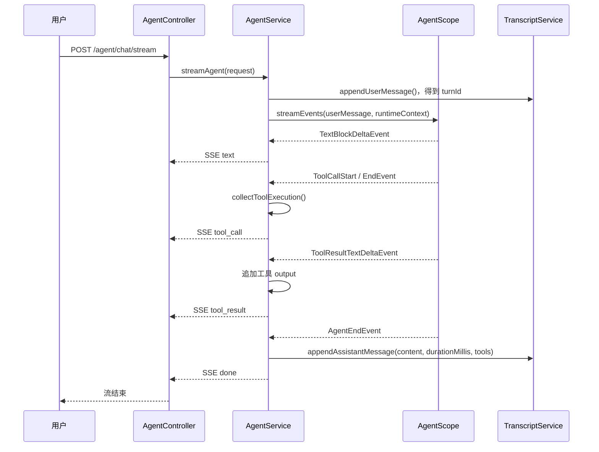

# ButvanAgent 工具调用与耗时持久化：后端分步接入教程

> 目标：用户重新打开会话时，除聊天文本外，还能恢复每一轮的**耗时**、**工具名**、**命令参数**、**工具输出**和**执行状态**。
>
> 本教程只修改后端，并且必须严格按顺序手动完成。每一步完成并编译通过后，才进入下一步；不要一次性复制所有代码。

---

## 1. 先理解问题与最终设计

### 1.1 为什么当前重新打开会话后会丢失工具卡片

当前链路分为两条：

```text
模型 / AgentScope 事件流
        │
        ├── TextBlockDeltaEvent          -> SSE text          -> 前端实时拼接正文
        ├── ToolCallStart / EndEvent     -> SSE tool_call     -> 前端实时显示工具卡片
        └── ToolResultTextDeltaEvent     -> SSE tool_result   -> 前端实时拼接工具输出

流结束时
        │
        └── TranscriptService 只写入 assistant 的 content 和 status
```

工具调用与耗时只存在于 SSE 连接期间的前端内存；`TranscriptService` 写入的 JSONL 消息没有这些字段。因此，重新请求 `GET /agent/sessions/{sessionId}` 时，后端只能返回聊天正文。

### 1.2 这次的持久化边界

不要把工具事件逐条写入 JSONL。工具输出常被拆成很多 `ToolResultTextDeltaEvent`；逐条写盘会产生大量碎片记录，也会让恢复逻辑复杂。

本教程采用“一轮对话、一条 assistant 记录”的设计：

```text
用户输入
  │
  ├── 立即写入 USER 消息，得到 turnId
  │
  └── Agent 流式执行期间
        ├── assistantContent 追加正文
        ├── toolExecutions 按 toolCallId 汇总工具调用与输出
        └── 流结束 / 失败 / 取消时
              └── 一次性写入 ASSISTANT 消息：
                    content + durationMillis + tools + status
```

这样 `turnId` 将同一轮的用户消息和助手消息对应起来；工具数组属于该轮的 assistant 消息。

### 1.3 最终 JSONL 记录示例

完成后，新写入的 assistant 行类似如下（为了阅读已换行，真实文件仍是一行 JSON）：

```json
{
  "id": "assistant-message-id",
  "turnId": "same-turn-id",
  "role": "ASSISTANT",
  "content": "已列出当前目录。",
  "createdAt": "2026-08-12T06:30:00Z",
  "status": "COMPLETED",
  "durationMillis": 3287,
  "tools": [
    {
      "toolCallId": "call_001",
      "toolName": "list_files",
      "command": "{\"path\":\".\"}",
      "output": "[FILE] /.gitignore...",
      "status": "COMPLETED"
    }
  ]
}
```

旧 JSONL 中没有 `durationMillis`、`tools` 两个字段。因为新字段使用可空值或默认空列表，旧会话仍可被 Jackson 正常读取；它们只是不包含历史工具详情。

---

## 2. 本次会修改哪些后端文件

```text
server-agents/src/main/java/butvan/agent/agents/
├── session/dto/TranscriptMessageDto.java  # 增加可持久化字段
├── session/TranscriptService.java         # 写入新字段
└── agent/AgentService.java                # 汇总流式事件、计算耗时并调用持久化
```

不需要新增 Controller，也不需要修改 `SessionDetailDto`：它本来就返回 `List<TranscriptMessageDto>`，DTO 增加字段后会自动通过会话详情接口返回。

### 2.1 开始前检查

先确认当前工作区的聊天功能正常，再执行：

```bash
cd /Users/butvan/Butvan_Projets/my_code/ButvanAgent/agent-backend
JAVA_HOME=$(/usr/libexec/java_home -v 21) mvn -pl server-agents test
```

如果这一步失败，先解决当前基线问题，不要开始后续改造。

---

## 3. 第一步：先扩展可持久化消息 DTO

### 3.1 这一步做什么

先让 `TranscriptMessageDto` 有能力表达“耗时 + 多次工具调用”。这一步只定义数据结构，不会改变实时 SSE 行为，也不会写入新数据。

### 3.2 修改 `TranscriptMessageDto.java`

打开：

`agent-backend/server-agents/src/main/java/butvan/agent/agents/session/dto/TranscriptMessageDto.java`

将整个文件替换为以下代码：

```java
package butvan.agent.agents.session.dto;

import java.time.Instant;
import java.util.List;

/** 用户界面能够稳定展示的一条完整消息。 */
public record TranscriptMessageDto(
        String id,
        String turnId,
        MessageRole role,
        String content,
        Instant createdAt,
        MessageStatus status,
        Long durationMillis,
        List<ToolExecutionDto> tools
) {

    /**
     * 统一处理旧记录缺失的新字段。
     *
     * <p>旧 JSONL 没有 tools 时，Jackson 会传入 null。这里转为空列表，
     * 调用方以后可以直接遍历 tools，不需要每次都判空。</p>
     */
    public TranscriptMessageDto {
        content = content == null ? "" : content;
        tools = tools == null ? List.of() : List.copyOf(tools);
    }

    /** 消息角色。 */
    public enum MessageRole {
        USER,
        ASSISTANT
    }

    /** assistant 消息的最终状态。 */
    public enum MessageStatus {
        COMPLETED,
        FAILED,
        CANCELLED
    }

    /**
     * 一次工具调用的完整记录。
     *
     * <p>一个 assistant 消息可包含多次工具调用，所以这个 DTO 放入 tools 列表中。
     * command 保存工具调用参数中的 command；对于 list_files 一类工具，它也可以是完整 JSON 参数。</p>
     */
    public record ToolExecutionDto(
            String toolCallId,
            String toolName,
            String command,
            String output,
            ToolStatus status
    ) {
        /** 防止异常事件携带 null 造成序列化或前端展示异常。 */
        public ToolExecutionDto {
            toolCallId = toolCallId == null ? "" : toolCallId;
            toolName = toolName == null ? "" : toolName;
            command = command == null ? "" : command;
            output = output == null ? "" : output;
        }
    }

    /** 工具本身的执行状态。 */
    public enum ToolStatus {
        RUNNING,
        COMPLETED,
        FAILED,
        CANCELLED
    }
}
```

### 3.3 为什么 `durationMillis` 用 `Long` 而不是 `long`

用户消息没有模型执行耗时，使用 `Long` 可以传入 `null`，从语义上表示“此消息不适用耗时”。assistant 消息一定传入非负毫秒值。

### 3.4 完成检查

执行：

```bash
JAVA_HOME=$(/usr/libexec/java_home -v 21) mvn -pl server-agents test
```

此时预期会出现构造器参数数量不匹配，位置在 `TranscriptService`。这是正常的下一步信号：DTO 已改变，而写入服务还没有给它提供新字段。

---

## 4. 第二步：让消息写入服务保存新字段

### 4.1 这一步做什么

`TranscriptService` 只负责 JSONL 的读、写、删，不负责理解 AgentScope 事件。现在只调整它的写入方法签名，让上层之后能把已经汇总好的耗时和工具列表传进来。

### 4.2 修改用户消息的构造参数

打开：

`agent-backend/server-agents/src/main/java/butvan/agent/agents/session/TranscriptService.java`

在 `appendUserMessage` 方法中，找到 `new TranscriptMessageDto(...)`，将最后一项：

```java
TranscriptMessageDto.MessageStatus.COMPLETED
```

替换为：

```java
TranscriptMessageDto.MessageStatus.COMPLETED,
null,       // 用户消息没有模型耗时
List.of()   // 用户消息没有工具执行记录
```

### 4.3 替换 assistant 写入方法

将原有的 `appendAssistantMessage` 整个方法替换为：

```java
/**
 * 在一次 Agent 流结束后写入完整 assistant 消息。
 *
 * @param sessionId 当前应用会话 ID
 * @param turnId 当前轮 ID，与对应用户消息一致
 * @param content 已汇总的模型正文
 * @param status 本轮最终状态
 * @param durationMillis 从 Agent 请求开始到结束的耗时（毫秒）
 * @param tools 已汇总的工具执行记录
 */
public synchronized void appendAssistantMessage(
        String sessionId,
        String turnId,
        String content,
        TranscriptMessageDto.MessageStatus status,
        long durationMillis,
        List<TranscriptMessageDto.ToolExecutionDto> tools
) {
    append(sessionId, new TranscriptMessageDto(
            UUID.randomUUID().toString(),
            turnId,
            TranscriptMessageDto.MessageRole.ASSISTANT,
            content == null ? "" : content,
            Instant.now(),
            status,
            durationMillis,
            tools
    ));
}
```

`java.util.List` 在当前文件中已经被导入，不需要再增加 import。

### 4.4 完成检查

再次执行：

```bash
JAVA_HOME=$(/usr/libexec/java_home -v 21) mvn -pl server-agents test
```

现在的编译错误应只剩 `AgentService` 调用 `appendAssistantMessage` 时参数不足。不要先在这里随便填空值；下一步会集中处理所有正常、失败和取消出口。

---

## 5. 第三步：在流开始时创建本轮收集器

### 5.1 这一步做什么

一轮模型输出包含多个原始事件。`AgentService` 负责把这些碎片临时汇总在内存中；只有本轮结束时才写入 `TranscriptService`。

### 5.2 增加 import

打开：

`agent-backend/server-agents/src/main/java/butvan/agent/agents/agent/AgentService.java`

在现有的 `java.nio.file.Paths` import 后增加：

```java
import java.time.Duration;
import java.time.Instant;
import java.util.LinkedHashMap;
import java.util.List;
```

保留已有的 `java.util.Map` import。`LinkedHashMap` 保证工具按实际调用顺序恢复，而不是按哈希顺序跳动。

### 5.3 修改 `produceEvents` 方法开头

在 `produceEvents` 方法的开头，原本有：

```java
StringBuilder assistantContent = new StringBuilder();
String turnId = null;
```

替换为：

```java
// 持续拼接模型正文；流结束后才一次性写入 JSONL。
StringBuilder assistantContent = new StringBuilder();

// key 是 AgentScope 事件中的 toolCallId，value 是该工具当前累计的完整状态。
// LinkedHashMap 保留工具调用发生的先后顺序，便于历史界面按原顺序展示。
Map<String, TranscriptMessageDto.ToolExecutionDto> toolExecutions = new LinkedHashMap<>();

// 用户消息入库后才有 turnId；异常发生在此之前时不应写 assistant 记录。
String turnId = null;

// 本轮耗时从开始处理请求起计算，正常结束、失败和取消都使用同一个起点。
Instant startedAt = Instant.now();
```

### 5.4 完成检查

先不要修改其他代码，执行 Maven。此时应该仍只报 `finishAssistantMessage` / `appendAssistantMessage` 参数不匹配；说明收集器声明正确。

---

## 6. 第四步：把实时工具事件同时汇总到内存

### 6.1 这一步做什么

`mapEvent` 已经把 AgentScope 事件翻译为项目的 `AgentStreamEvent.ToolCall` 和 `AgentStreamEvent.ToolResult`。所以不要重复解析 AgentScope 事件；直接消费翻译后的业务事件即可。

在 `produceEvents` 的循环中，找到：

```java
if (mappedEvent instanceof AgentStreamEvent.TextDelta textDelta) {
    assistantContent.append(textDelta.content());
}
```

紧接着增加：

```java
// 同一事件仍会被放入 SSE 队列；这里仅额外保存一份可恢复的汇总状态。
collectToolExecution(mappedEvent, toolExecutions);
```

### 6.2 在 `finishAssistantMessage` 前新增两个完整方法

在 `AgentService` 中，放在 `finishAssistantMessage` 方法之前，新增以下两个方法：

```java
/**
 * 汇总实时工具事件。
 *
 * <p>ToolCallStart 先产生空 command 的 ToolCall，ToolCallEnd 再产生带完整参数的 ToolCall；
 * 因此必须保留旧 command，不能让后来的空值覆盖完整值。</p>
 */
private void collectToolExecution(
        AgentStreamEvent event,
        Map<String, TranscriptMessageDto.ToolExecutionDto> toolExecutions
) {
    if (event instanceof AgentStreamEvent.ToolCall toolCall) {
        TranscriptMessageDto.ToolExecutionDto previous = toolExecutions.get(toolCall.toolCallId());

        toolExecutions.put(toolCall.toolCallId(), new TranscriptMessageDto.ToolExecutionDto(
                toolCall.toolCallId(),
                toolCall.toolName(),
                toolCall.command().isBlank() && previous != null ? previous.command() : toolCall.command(),
                previous == null ? "" : previous.output(),
                TranscriptMessageDto.ToolStatus.RUNNING
        ));
        return;
    }

    if (event instanceof AgentStreamEvent.ToolResult toolResult) {
        TranscriptMessageDto.ToolExecutionDto previous = toolExecutions.get(toolResult.toolCallId());

        // ToolResultTextDeltaEvent 可能被多次触发，因此输出必须追加而不是覆盖。
        toolExecutions.put(toolResult.toolCallId(), new TranscriptMessageDto.ToolExecutionDto(
                toolResult.toolCallId(),
                toolResult.toolName(),
                previous == null ? "" : previous.command(),
                (previous == null ? "" : previous.output()) + toolResult.result(),
                TranscriptMessageDto.ToolStatus.COMPLETED
        ));
    }
}

/**
 * 将尚未收到结果的 RUNNING 工具转换为最终状态。
 *
 * <p>若整轮已经结束却工具仍是 RUNNING，不能把它保存为“永远执行中”。
 * 正常结束或失败时标记 FAILED；客户端断开时标记 CANCELLED。</p>
 */
private List<TranscriptMessageDto.ToolExecutionDto> finalizeToolExecutions(
        Map<String, TranscriptMessageDto.ToolExecutionDto> toolExecutions,
        TranscriptMessageDto.MessageStatus messageStatus
) {
    TranscriptMessageDto.ToolStatus fallbackStatus = switch (messageStatus) {
        case COMPLETED, FAILED -> TranscriptMessageDto.ToolStatus.FAILED;
        case CANCELLED -> TranscriptMessageDto.ToolStatus.CANCELLED;
    };

    return toolExecutions.values().stream()
            .map(tool -> tool.status() == TranscriptMessageDto.ToolStatus.RUNNING
                    ? new TranscriptMessageDto.ToolExecutionDto(
                            tool.toolCallId(),
                            tool.toolName(),
                            tool.command(),
                            tool.output(),
                            fallbackStatus
                    )
                    : tool)
            .toList();
}
```

### 6.3 完成检查

执行 Maven。若报错集中在 `finishAssistantMessage` 的参数，说明工具汇总部分已经独立完成；进入最后一步统一改持久化出口。

---

## 7. 第五步：统一在结束出口写入耗时和工具记录

### 7.1 为什么要先改 helper，再改所有调用点

`produceEvents` 有多个结束路径：

1. 客户端取消；
2. SSE 队列被中断；
3. 收到正常完成事件；
4. 事件流自然结束；
5. 异常失败。

如果只在“正常完成”处保存，会在失败或取消时丢失已执行的工具。先让唯一的 `finishAssistantMessage` 支持完整数据，再把全部出口传入同一批变量，才能保证行为一致。

### 7.2 替换 `finishAssistantMessage` 方法

将 `AgentService` 原有的 `finishAssistantMessage` 整个方法替换为：

```java
/**
 * 在本轮结束时写入唯一一条 assistant 消息，并更新侧边栏摘要。
 *
 * <p>此方法不得在流中逐 token 调用；每轮只应调用一次。</p>
 */
private void finishAssistantMessage(
        String sessionId,
        String turnId,
        StringBuilder assistantContent,
        TranscriptMessageDto.MessageStatus status,
        Instant startedAt,
        Map<String, TranscriptMessageDto.ToolExecutionDto> toolExecutions
) {
    String content = assistantContent.toString();

    // 防止系统时钟微小回拨产生负数。
    long durationMillis = Math.max(0, Duration.between(startedAt, Instant.now()).toMillis());

    transcriptService.appendAssistantMessage(
            sessionId,
            turnId,
            content,
            status,
            durationMillis,
            finalizeToolExecutions(toolExecutions, status)
    );

    // 侧边栏预览仍只使用最终正文，不把工具输出混入会话标题和预览。
    sessionCatalogService.touch(sessionId, content);
}
```

### 7.3 修改全部调用点

现在在 `AgentService` 中搜索：

```java
finishAssistantMessage(
```

`produceEvents` 内一共有五处调用。将每一处原有的最后一个 `MessageStatus` 参数后面，都加上：

```java
, startedAt, toolExecutions
```

例如取消时的调用应变为：

```java
finishAssistantMessage(
        request.sessionId(),
        turnId,
        assistantContent,
        TranscriptMessageDto.MessageStatus.CANCELLED,
        startedAt,
        toolExecutions
);
```

正常终态的完整写法是：

```java
finishAssistantMessage(
        request.sessionId(),
        turnId,
        assistantContent,
        mappedEvent instanceof AgentStreamEvent.Failed
                ? TranscriptMessageDto.MessageStatus.FAILED
                : TranscriptMessageDto.MessageStatus.COMPLETED,
        startedAt,
        toolExecutions
);
```

同样修改以下三个出口：

```java
// 事件流自然结束
finishAssistantMessage(
        request.sessionId(), turnId, assistantContent,
        TranscriptMessageDto.MessageStatus.COMPLETED,
        startedAt, toolExecutions
);

// catch 中的取消
finishAssistantMessage(
        request.sessionId(), turnId, assistantContent,
        TranscriptMessageDto.MessageStatus.CANCELLED,
        startedAt, toolExecutions
);

// catch 中的失败
finishAssistantMessage(
        sessionId, turnId, assistantContent,
        TranscriptMessageDto.MessageStatus.FAILED,
        startedAt, toolExecutions
);
```

### 7.4 完成检查

执行：

```bash
JAVA_HOME=$(/usr/libexec/java_home -v 21) mvn -pl server-agents test
```

这一步通过后，`server-agents` 的实现已完成：所有一次聊天结束的路径都会持久化工具记录和耗时。

---

## 8. 第六步：验证接口返回与持久化文件

### 8.1 启动后端

在后端目录执行：

```bash
JAVA_HOME=$(/usr/libexec/java_home -v 21) mvn -pl server-network -am spring-boot:run
```

然后在已有前端中发起一个会触发工具的请求，例如“列出当前目录下的文件”。

### 8.2 查看会话详情接口

使用实际 sessionId 请求：

```bash
curl http://localhost:8081/agent/sessions/<sessionId>
```

在 assistant 消息中确认以下字段：

- `durationMillis` 是非负数字；
- `tools` 是数组；
- 每个工具有 `toolCallId`、`toolName`、`command`、`output`、`status`；
- 多个工具按实际调用顺序排列；
- 工具输出分块到达时，`output` 是完整拼接结果，而不是只剩最后一块。

### 8.3 重新打开会话的说明

后端到这里已经能从 `GET /agent/sessions/{sessionId}` 返回完整数据。要让 UI 显示历史工具卡片和精确耗时，前端的 `TranscriptMessageDto` 与会话恢复映射还需要读取 `durationMillis` 和 `tools` 字段。

这不是本教程的修改范围：本教程刻意只完成后端，避免把前端展示层和后端持久化层混在同一步中。

---

## 9. 实现后的完整数据链路复盘



关键原则：**SSE 用于实时体验，Transcript 用于重新打开会话后的稳定恢复；二者都来自同一批 `AgentStreamEvent`，但职责不同。**

---

## 10. 安全与后续演进

1. 工具命令和输出可能包含敏感信息。生产版本应限制最大长度、按工具类型脱敏，并避免在普通 INFO 日志中输出完整命令。
2. 当前 JSONL 适合本地单用户桌面应用。需要多设备同步、全文检索或高并发时，再迁移到数据库；迁移时仍保持 `TranscriptMessageDto` 的接口语义。
3. 不要把 AgentScope 的 `AgentState` 直接作为 UI 历史。它服务于模型上下文恢复，可能受到压缩策略影响；本教程中的 Transcript 才是用户可见历史的稳定来源。
4. 当工具输出可能非常大时，应引入单工具输出上限或独立文件引用，避免一个 JSONL 行无限增长。
