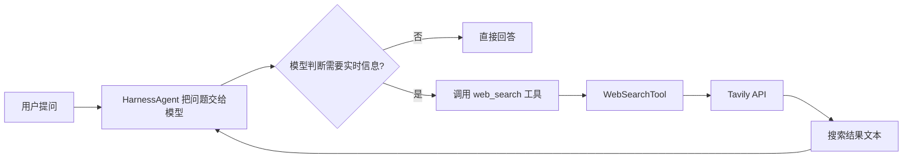

# ButvanAgent 接入 Tavily 联网搜索 · 手把手教学

> 这是一份教学文档：请按照步骤**自己动手实现**。每一步都会说明「要做什么、为什么这么做、代码如何理解」。代码块内的中文注释请保留，它们是理解每一行的线索。
>
> 本文只负责教学，**不会替你改动任何源码文件**。实现过程中遇到问题可以回来对照「第 8 节：常见问题排查」。

## 适用环境

- Java 21
- Spring Boot 3.4.3（自带 `spring-boot-starter-web`，提供 HTTP 客户端）
- AgentScope 2.0.0（`@Tool` / `@ToolParam` / `Toolkit`）
- 改动范围：后端 `agent-backend/server-agents` 模块

---

## 0. 整体设计：先看懂调用链

联网搜索不是「让模型自己上网」，而是给模型**一把新的工具**。整个链路如下：



这个设计遵循四条原则，和后面的步骤一一对应：

1. **工具化，不硬编码**：通过 AgentScope 的 `Toolkit` 注册工具，模型根据用户问题自主决定「要不要搜索、搜什么」。对应第 5、6 步。
2. **密钥与配置分离**：Tavily API Key 放在 `~/.butvan-agent/config.json`，绝不写进源码、yml 或日志（项目 DOX 规范）。对应第 2、3、4 步。
3. **搜索结果视为不可信输入**：网络内容可能包含恶意指令，必须做长度截断，不能整段塞进模型上下文。对应第 5 步。
4. **失败不能拖垮 Agent**：网络请求要设超时，出错时返回一段可读的错误文本，而不是抛异常中断整个对话。对应第 5 步。

### 本次需要新增 / 修改的文件

| 文件 | 动作 | 职责 |
| --- | --- | --- |
| `~/.butvan-agent/config.json` | 手动新增 `webSearch` 节点 | 存放开关、API Key、结果数量等（不进入仓库） |
| `agent-backend/server-agents/src/main/java/butvan/agent/agents/config/TavilyConfigData.java` | 新增 | 配置数据记录（record） |
| `agent-backend/server-agents/src/main/java/butvan/agent/agents/config/TavilyProperties.java` | 新增 | 从 config.json 读取 Tavily 配置 |
| `agent-backend/server-agents/src/main/java/butvan/agent/agents/tool/impl/WebSearchTool.java` | 新增 | 调用 Tavily API 的核心工具 |
| `agent-backend/server-agents/src/main/java/butvan/agent/agents/tool/ToolRegistry.java` | 修改 | 把搜索工具注册进 AgentScope `Toolkit` |

---

## 1. 第 1 步：注册 Tavily，获取 API Key

**要做什么**：去 Tavily 官网注册账号，生成一个 `tvly-` 开头的 API Key。

**为什么**：Tavily 是专为 AI Agent 设计的搜索服务，REST 接口简单，返回的结果已经整理成适合喂给模型的摘要格式。

1. 打开 [Tavily 官网](https://tavily.com) 注册账号。
2. 进入 Dashboard，在 API Keys 页面生成一个新 Key（形如 `tvly-xxxxxxxx`）。
3. 免费套餐通常每月有一定搜索额度（具体以官网当前页面为准），先够开发使用。
4. **先用 curl 验证 Key 可用**，避免后面排错时分不清是代码问题还是 Key 问题：

```bash
curl -X POST https://api.tavily.com/search \
  -H "Authorization: Bearer tvly-你的Key" \
  -H "Content-Type: application/json" \
  -d '{"query":"今天 AI 领域有什么大新闻","max_results":3}'
```

**怎么确认成功**：返回一段 JSON，里面有 `results` 数组，说明 Key 有效、网络可达（Tavily 是海外服务，如果这一步超时或连不上，先解决网络问题再做后面的步骤）。

---

## 2. 第 2 步：在 config.json 中写入搜索配置

**要做什么**：在 `~/.butvan-agent/config.json` 里新增一个顶层 `webSearch` 节点。

**为什么放这里**：项目规范要求用户密钥统一持久化在 `~/.butvan-agent/config.json`，禁止写入 `application.yml` 或源码；而且 `LocalConfigService` 用 `@JsonAnySetter` 保留了未知顶层节点，即使之后保存模型配置，也不会把这个节点覆盖掉（飞书渠道配置就是这么做的）。

打开 `~/.butvan-agent/config.json`，把下面这段**作为顶层节点**加进去（和 `providers`、`activeModel` 平级）：

```json
{
  "webSearch": {
    "enabled": true,
    "apiKey": "tvly-你的Key",
    "maxResults": 5,
    "searchDepth": "basic"
  }
}
```

字段说明：

| 字段 | 含义 | 建议值 |
| --- | --- | --- |
| `enabled` | 总开关，`false` 时工具直接拒绝执行 | `true` |
| `apiKey` | 第 1 步拿到的 Tavily Key | `tvly-...` |
| `maxResults` | 每次搜索最多返回几条结果 | `5`（1-10 之间） |
| `searchDepth` | 搜索深度：`basic`（快）/ `advanced`（更准更慢）/ `fast` / `ultra-fast` | `basic` |

**注意**：这个文件在你的用户目录下，属于本地配置，**不要提交进仓库**。

---

## 3. 第 3 步：编写配置数据类 `TavilyConfigData`

**要做什么**：新建一个 Java record，表示「一份 Tavily 配置」长什么样。

**为什么**：项目里飞书模块用的是「数据类 + 读取服务」两个类：数据类只描述数据，读取服务负责从文件解析。这样职责单一：`TavilyConfigData` 不懂文件，`TavilyProperties` 不懂业务。

新建文件：`agent-backend/server-agents/src/main/java/butvan/agent/agents/config/TavilyConfigData.java`

```java
package butvan.agent.agents.config;

/**
 * Tavily 联网搜索本地配置，对应 config.json 中的 webSearch 节点。
 *
 * <p>record 是 Java 16+ 的不可变数据类：字段一旦创建就不能修改，
 * 非常适合表示「从文件里读出来的一份配置」。</p>
 */
public record TavilyConfigData(
        boolean enabled,      // 是否启用联网搜索
        String apiKey,        // Tavily API Key
        int maxResults,       // 每次搜索最多返回几条结果
        String searchDepth    // 搜索深度：basic / advanced / fast / ultra-fast
) {

    /**
     * 未配置或读取失败时返回的默认值。
     *
     * <p>默认 enabled=false 是刻意为之：宁可让搜索功能静默关闭，
     * 也不能在没有 Key 的情况下发起请求浪费额度。</p>
     */
    public static TavilyConfigData disabled() {
        return new TavilyConfigData(false, "", 5, "basic");
    }

    /**
     * 判断是否具备调用搜索的条件：已启用且 Key 非空。
     *
     * <p>这个方法会被 WebSearchTool 在每次调用前检查，防止误用。</p>
     */
    public boolean isReady() {
        return enabled
                && apiKey != null && !apiKey.isBlank()
                && maxResults >= 1;
    }
}
```

代码理解要点：

- `record` 自动生成构造函数、`apiKey()` 这类访问器，不需要手写 getter。
- `disabled()` 是「兜底值」：文件缺失、节点缺失、解析失败时，读取服务都会返回它，调用方不用处理各种 null。
- `isReady()` 把「能不能用」的判断收拢在这一个地方，工具类里就不需要重复写判空逻辑。

---

## 4. 第 4 步：编写配置读取类 `TavilyProperties`

**要做什么**：新建一个 Spring `@Component`，负责从 `~/.butvan-agent/config.json` 的 `webSearch` 节点读取配置。

**为什么**：照搬项目里 `FeishuProperties` 的成熟写法，保证项目风格一致；同时用「读取失败返回禁用态」的方式兜底，不让配置问题变成启动崩溃。

新建文件：`agent-backend/server-agents/src/main/java/butvan/agent/agents/config/TavilyProperties.java`

```java
package butvan.agent.agents.config;

import com.fasterxml.jackson.databind.JsonNode;
import com.fasterxml.jackson.databind.ObjectMapper;
import lombok.extern.slf4j.Slf4j;
import org.springframework.stereotype.Component;

import java.io.IOException;
import java.nio.file.Files;
import java.nio.file.Path;
import java.nio.file.Paths;

/**
 * Tavily 搜索配置读取服务。
 *
 * <p>只从本地 {@code ~/.butvan-agent/config.json} 的 webSearch 节点读取配置，
 * 禁止把 API Key 写入 yml、源码或日志。</p>
 */
@Slf4j
@Component
public class TavilyProperties {

    /** 本地配置文件路径：~/.butvan-agent/config.json */
    private static final Path CONFIG_PATH =
            Paths.get(System.getProperty("user.home"), ".butvan-agent", "config.json");

    /** Jackson JSON 解析器（spring-boot-starter-web 已自带） */
    private final ObjectMapper objectMapper = new ObjectMapper();

    /**
     * 读取当前生效的 Tavily 配置。
     *
     * <p>文件缺失、节点缺失或解析失败时返回禁用状态，调用方无需判空。</p>
     *
     * @return Tavily 配置
     */
    public TavilyConfigData load() {
        try {
            // 文件不存在时直接返回禁用态，不算错误
            if (!Files.isRegularFile(CONFIG_PATH)) {
                return TavilyConfigData.disabled();
            }

            // 解析整个 JSON 文件，再定位 webSearch 节点
            JsonNode root = objectMapper.readTree(CONFIG_PATH.toFile());
            JsonNode webSearch = root.path("webSearch");

            // 节点缺失时同样返回禁用态
            if (webSearch.isMissingNode() || webSearch.isNull()) {
                return TavilyConfigData.disabled();
            }

            // path(...) 拿不到字段时返回 asXxx 的默认值，不会抛异常
            return new TavilyConfigData(
                    webSearch.path("enabled").asBoolean(false),
                    webSearch.path("apiKey").asText(""),
                    webSearch.path("maxResults").asInt(5),
                    webSearch.path("searchDepth").asText("basic")
            );
        } catch (IOException e) {
            // 只记录文件路径，绝不记录 Key 内容
            log.error("读取本地 Tavily 配置失败，联网搜索将保持禁用：{}", CONFIG_PATH, e);
            return TavilyConfigData.disabled();
        }
    }
}
```

代码理解要点：

- `@Component` 让 Spring 在启动时创建它，并可以自动注入给其他 Bean（第 5、6 步会用到）。
- `JsonNode.path("webSearch")` 比 `get("webSearch")` 安全：节点不存在时返回一个「缺失节点」而不是 null，后续调用不会空指针。
- 异常只记录文件路径和堆栈，**不记录 API Key**——这是项目安全规范（DOX 明确禁止在日志输出密钥）。
- 每次调用 `load()` 都会重新读文件，所以改完 config.json **不需要重启**就能生效，方便调试。

---

## 5. 第 5 步：编写核心工具类 `WebSearchTool`

**要做什么**：新建一个 `@Component` 工具类，用 `@Tool` 注解暴露一个 `web_search` 方法给模型调用，方法内部请求 Tavily API 并整理结果。

**为什么这是核心**：AgentScope 会扫描带 `@Tool` 注解的类，把方法名、参数描述生成成「函数定义」交给模型；模型判断需要搜索时，就会按这个定义传入参数调用。所以方法名和参数描述写得越清楚，模型调用越准确。

新建文件：`agent-backend/server-agents/src/main/java/butvan/agent/agents/tool/impl/WebSearchTool.java`

```java
package butvan.agent.agents.tool.impl;

import butvan.agent.agents.config.TavilyConfigData;
import butvan.agent.agents.config.TavilyProperties;
import com.fasterxml.jackson.databind.JsonNode;
import com.fasterxml.jackson.databind.ObjectMapper;
import io.agentscope.core.tool.Tool;
import io.agentscope.core.tool.ToolParam;
import lombok.extern.slf4j.Slf4j;
import org.springframework.http.MediaType;
import org.springframework.http.client.SimpleClientHttpRequestFactory;
import org.springframework.stereotype.Component;
import org.springframework.web.client.RestClient;

import java.util.LinkedHashMap;
import java.util.Map;

/**
 * Tavily 联网搜索工具。
 *
 * <p>模型在需要最新信息时会调用本工具的 web_search 方法；
 * 返回的搜索结果一律视为不可信输入，统一做长度截断。</p>
 */
@Slf4j
@Component
public class WebSearchTool {

    /** Tavily 搜索接口地址 */
    private static final String TAVILY_URL = "https://api.tavily.com/search";

    /** 单条摘要最多保留的字符数，防止结果撑爆模型上下文 */
    private static final int MAX_CONTENT_LENGTH = 500;

    /** 配置读取服务：每次调用都重新读，改配置无需重启 */
    private final TavilyProperties tavilyProperties;

    /** Spring 6 提供的声明式 HTTP 客户端（spring-boot-starter-web 自带） */
    private final RestClient restClient;

    /** JSON 解析工具 */
    private final ObjectMapper objectMapper = new ObjectMapper();

    /**
     * 构造注入配置服务，并构建带超时的 HTTP 客户端。
     *
     * @param tavilyProperties 配置读取服务（Spring 自动注入）
     */
    public WebSearchTool(TavilyProperties tavilyProperties) {
        this.tavilyProperties = tavilyProperties;
        this.restClient = buildRestClient();
    }

    /** 构建带超时限制的 HTTP 客户端，避免搜索请求长时间挂起拖住 Agent */
    private RestClient buildRestClient() {
        SimpleClientHttpRequestFactory factory = new SimpleClientHttpRequestFactory();
        factory.setConnectTimeout(5_000); // 建立连接最长 5 秒
        factory.setReadTimeout(15_000);   // 读取响应最长 15 秒
        return RestClient.builder()
                .requestFactory(factory)
                .build();
    }

    /**
     * 联网搜索入口。
     *
     * <p>AgentScope 通过 @Tool 注解把本方法暴露给模型，
     * 方法返回的字符串会作为工具结果注入模型上下文。</p>
     */
    @Tool(name = "web_search", description = "搜索互联网获取最新信息。当用户询问实时资讯、最新事件或模型训练数据之外的动态时调用。")
    public String search(
            @ToolParam(name = "query", description = "要搜索的自然语言关键词或问题") String query,
            @ToolParam(name = "max_results", description = "返回结果条数上限（1-10），不传则用配置默认值", required = false) Integer maxResults
    ) {
        // 每次调用都重新读取配置：修改 config.json 后无需重启即可生效
        TavilyConfigData config = tavilyProperties.load();

        // 未启用或没有 Key 时给模型明确提示，而不是抛异常中断整个 Agent
        if (!config.isReady()) {
            return "联网搜索未启用：请先在 ~/.butvan-agent/config.json 中配置 webSearch.enabled=true 和 webSearch.apiKey。";
        }
        if (query == null || query.isBlank()) {
            return "Error: query 参数不能为空。";
        }

        // 校验并收敛结果数量，防止模型传入过大的值
        int limit = (maxResults == null || maxResults < 1 || maxResults > 10)
                ? config.maxResults() : maxResults;

        try {
            // 组装 Tavily 请求体：只有搜索参数，Key 通过请求头传递
            Map<String, Object> body = new LinkedHashMap<>();
            body.put("query", query);
            body.put("search_depth", config.searchDepth());
            body.put("max_results", limit);
            body.put("include_answer", true); // 让 Tavily 额外生成一段综合回答

            // 发起请求：Authorization 头携带 Key，Key 不进入请求体与日志
            String responseBody = restClient.post()
                    .uri(TAVILY_URL)
                    .header("Authorization", "Bearer " + config.apiKey())
                    .contentType(MediaType.APPLICATION_JSON)
                    .body(body)
                    .retrieve()
                    .body(String.class);

            return formatResults(query, responseBody);
        } catch (Exception e) {
            // 只记录查询词，不记录 Key 和完整响应体
            log.warn("Tavily 搜索失败，query={}", query, e);
            return "搜索失败：" + e.getMessage();
        }
    }

    /** 把 Tavily 返回的 JSON 整理成模型容易阅读的纯文本 */
    private String formatResults(String query, String responseBody) throws Exception {
        JsonNode root = objectMapper.readTree(responseBody);
        StringBuilder sb = new StringBuilder();

        // include_answer=true 时 Tavily 会给一段综合回答，优先展示
        if (root.hasNonNull("answer") && !root.get("answer").asText().isBlank()) {
            sb.append("综合回答：").append(root.get("answer").asText()).append("\n\n");
        }

        JsonNode results = root.path("results");
        sb.append("针对“").append(query).append("”的搜索结果（共 ").append(results.size()).append(" 条）：\n");
        for (int i = 0; i < results.size(); i++) {
            JsonNode item = results.get(i);
            // 逐条输出：序号 + 标题 + 链接 + 截断后的摘要
            sb.append(i + 1).append(". ").append(item.path("title").asText("无标题")).append("\n");
            sb.append("   链接：").append(item.path("url").asText("")).append("\n");
            sb.append("   摘要：").append(truncate(item.path("content").asText(""), MAX_CONTENT_LENGTH)).append("\n\n");
        }
        return sb.toString();
    }

    /** 超过长度上限的文本截断并加省略号，防止上下文被撑爆 */
    private String truncate(String text, int maxLength) {
        if (text == null || text.length() <= maxLength) {
            return text == null ? "" : text;
        }
        return text.substring(0, maxLength) + "……";
    }
}
```

代码理解要点（按方法顺序）：

1. **字段与构造**：工具不自己 `new` 配置服务，而是通过构造函数让 Spring 注入 `TavilyProperties`。这叫构造注入，好处是依赖关系清晰、便于测试。
2. **`buildRestClient()`**：`RestClient` 是 Spring 6 的 HTTP 客户端。这里特意设置了连接和读取超时——没有超时的网络调用会让 Agent 卡死。
3. **`@Tool` / `@ToolParam`**：
   - `@Tool(name = "web_search", description = "...")` 定义工具名和说明，模型看到说明才知道什么时候该用它；
   - `@ToolParam` 定义每个参数，`required = false` 表示模型可以不传 `max_results`，这时走配置默认值。
4. **`search()` 方法体**：
   - 先 `load()` 配置并 `isReady()` 检查，未启用时返回提示文本而不是抛异常——工具抛异常会打断整个对话流，返回文本则模型可以正常转述给用户；
   - 请求体用 `LinkedHashMap` 保证字段顺序稳定，`contentType(APPLICATION_JSON)` 让 RestClient 自动把 Map 序列化成 JSON；
   - `Authorization: Bearer <key>` 是 Tavily 官方要求的认证方式（当前文档），Key 不写进请求体。
5. **`formatResults()`**：Tavily 返回的是 JSON，模型直接读 JSON 容易迷失，这里整理成「综合回答 + 编号列表」的纯文本；`include_answer=true` 时 Tavily 会给一段现成的综合回答。
6. **`truncate()`**：单条摘要最多 500 字。搜索结果来自外部网站，可能是不可信甚至带恶意指令的内容，截断既是防上下文爆炸，也是降低注入风险的手段。
7. **日志脱敏**：所有日志只记录 `query`，绝不记录 Key 和完整响应体。

---

## 6. 第 6 步：把工具注册进 `ToolRegistry`

**要做什么**：修改 `ToolRegistry`，让它构造时接收 `WebSearchTool` 并调用 `toolkit.registerTool(...)`。

**为什么**：`AgentService.createHarnessAgent()` 在构建 Agent 时调用 `toolRegistry.getToolkit()` 把工具集挂到 Agent 上。所以只有在这里注册过的工具，模型才看得到。

修改文件：`agent-backend/server-agents/src/main/java/butvan/agent/agents/tool/ToolRegistry.java`

```java
package butvan.agent.agents.tool;

import butvan.agent.agents.tool.impl.WebSearchTool;
import io.agentscope.core.tool.Toolkit;
import org.springframework.stereotype.Component;

/**
 * AgentScope 工具注册中心：集中注册所有暴露给模型的原生工具。
 */
@Component
public class ToolRegistry {

    private final Toolkit toolkit;

    /**
     * 构造注入 WebSearchTool 并注册到 Toolkit。
     *
     * <p>让 Spring 负责组装依赖，工具类内部不需要自己 new 配置服务。</p>
     *
     * @param webSearchTool 联网搜索工具（Spring 自动注入）
     */
    public ToolRegistry(WebSearchTool webSearchTool) {
        this.toolkit = new Toolkit();

        // 注册联网搜索：模型判断需要实时信息时会自主调用 web_search
        this.toolkit.registerTool(webSearchTool);

        // 注意：BashTool 等原生工具保持注释状态，本次只接入搜索，不扩大改动范围
    }

    /** 获取配置好的 AgentScope Toolkit 容器 */
    public Toolkit getToolkit() {
        return this.toolkit;
    }
}
```

代码理解要点：

- 原来 `ToolRegistry` 是无参构造，现在改成有参构造：Spring 发现 `ToolRegistry` 依赖 `WebSearchTool`，会自动先创建它再传进来（依赖注入闭环：`TavilyProperties` → `WebSearchTool` → `ToolRegistry`）。
- `registerTool(Object)` 会反射扫描对象上带 `@Tool` 的方法，把 `web_search` 变成模型可调用的函数。
- 现有的 `BashTool`、`ReadFileTool` 等仍然是注释状态，**保持原样**——本次任务只接入搜索，不顺手启用其他工具（项目规范：不修复与当前任务无关的问题）。

---

## 7. 第 7 步：编译、启动、验证

### 7.1 编译

在仓库根目录执行：

```bash
mvn -f agent-backend/pom.xml -pl server-agents -am compile
```

看到 `BUILD SUCCESS` 说明三个新类语法、依赖、注解都没有问题。如果报错，先看第 8 节。

### 7.2 启动后端

用你平时的方式启动（IDE 里运行 `ButVanAgentApplication`，或 `mvn spring-boot:run`）。启动日志里出现 `TavilyProperties` 相关 Bean 没有报错即可。

### 7.3 功能验证

1. 确认配置：`cat ~/.butvan-agent/config.json`，能看到 `webSearch` 节点且 `enabled: true`。
2. 打开前端，向 Agent 发一条消息，例如：

   > 请用联网搜索帮我查一下今天 AI 行业的最新动态。

3. 预期现象：
   - 模型先决定调用 `web_search` 工具（可通过后端日志或前端展示观察到工具调用）；
   - 工具返回「综合回答 + 搜索结果列表」；
   - 模型基于结果组织最终回答，并附带来源链接。
4. 如果模型直接回答而没有搜索，试试把问题写得更明确，例如「请先搜索再回答……」。部分模型需要用户显式要求才会触发工具。

### 7.4 验证工具本身（可选）

不启动整个后端，也可以用第 1 步的 curl 验证 Key；想单独验证 Java 调用，可以写一个临时的 `main` 方法或单元测试调用 `WebSearchTool.search(...)`（`TavilyProperties` 需要能读到真实配置）。

---

## 8. 常见问题排查

| 现象 | 原因 | 处理 |
| --- | --- | --- |
| 返回 `Unauthorized` / 401 | API Key 错误，或 `Authorization` 头拼写不对 | 检查 config.json 里的 Key 是否完整 `tvly-` 开头；确认请求头是 `Authorization: Bearer <key>` |
| 返回 432 / 429 | 超出套餐额度或触发频率限制 | 登录 Tavily Dashboard 查看用量，等待或升级套餐 |
| 请求超时 / 连接失败 | Tavily 是海外服务，网络不可达 | 检查代理或网络；可适当调大 `buildRestClient()` 里的超时时间 |
| 模型从不调用 `web_search` | 提示词里没有说明能力，或模型对工具调用支持较弱 | 在系统提示词（`PromptBuilder`）中明确「你可以使用 web_search 搜索实时信息」；或让用户显式要求搜索 |
| Spring 启动报 `NoSuchBeanDefinitionException: TavilyProperties` | 文件不在组件扫描范围内 | 确认 `TavilyProperties.java` 在 `butvan.agent.agents.config` 包下且带 `@Component` |
| 编译报注解属性不存在 | AgentScope 版本不匹配 | 项目当前用 2.0.0，`@ToolParam` 支持 `required`；确认没有本地覆盖版本 |
| 修改 config.json 后不生效 | 可能没保存成功或 JSON 格式错误 | 重新执行 `cat ~/.butvan-agent/config.json`，用 JSON 校验工具确认语法 |

---

## 9. 收尾：对照项目规范的完成自查

实现完成后，请对照根目录 `AGENTS.md` 的工程规范逐项自查：

- [ ] API Key 只存在于 `~/.butvan-agent/config.json`，未写入 `application.yml`、源码或任何日志。
- [ ] 工具类位于 `tool/impl/`，配置类位于 `config/`，没有新增无职责说明的杂目录。
- [ ] 日志只记录 `query`，不记录 Key 与完整响应体。
- [ ] 搜索结果做了长度截断，视为不可信输入处理。
- [ ] 已执行 `mvn ... compile` 且通过。
- [ ] 改动范围仅限搜索相关文件，没有顺手启用 `BashTool` 等其他工具。
- [ ] 若后续把搜索能力文档化（如本文补充截图），放在 `docs/` 下，使用中文。

### 可选的进阶方向（本次不需要实现）

- 给 `web_search` 增加 `include_domains` / `exclude_domains`，实现「只搜可信域名」的白名单能力。
- 把 `enabled` 开关接到前端设置页，让用户可视化开启/关闭联网搜索。
- 为搜索结果增加缓存，避免相同查询重复消耗 Tavily 额度。
- 对照 Codex 的设计，把搜索模式拆成「缓存模式 / 实时模式」，默认走缓存、需要最新信息时再实时搜索。
